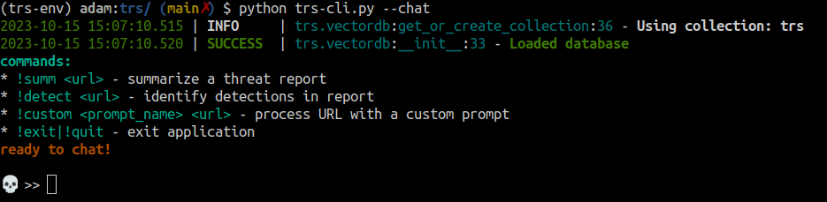
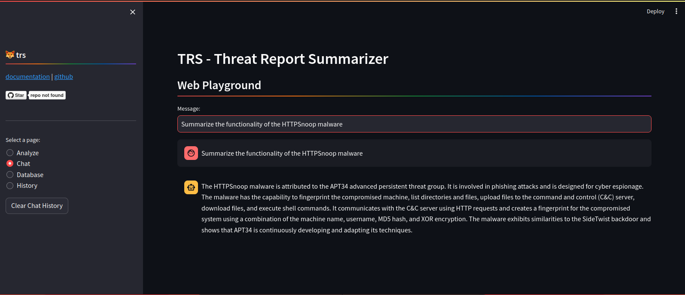

# trs

## Overview 🏕️
`trs` leverages an LLM (OpenAI) to chat with and analyze cyber threat intelligence reports and blogs. 

Supply a threat report URL to pre-built commands for summarization, MITRE TTP extraction, mindmap creation, and identification of detection opportunities, or run your own custom prompts against the URL's text.

Each URL's text content is stored in a Chroma vector database so you can have QnA / Retrieval-Augmented-Generation (RAG) chat sessions with your stored data.

The OpenAI model `gpt-3.5-turbo-16k` is used in order to support larger contexts more easily, but feel free to swap this out for `gpt-4-32k`.

**Full documentation:** [https://trs.deadbits.ai](https://trs.deadbits.ai)

## Features ✨
- **Report Summarization**: Concise summary of threat reports
- **TTP Extraction**: Extract MITRE ATT&CK tactics, techniques, and procedures
- **IOC Extraction**: Extract IOCs via [python-iocextract](https://github.com/InQuest/iocextract)
- **Mindmap Creation**: Generate [Mermaid mindmap](https://mermaid.live/) representing report artifacts
- **Detection Opportunities**: Identify potential threat detections 
- **Custom Prompts**: Run custom prompts against reports
- **Chat Mode**: Interactive Q&A with stored data via LLM
- **Web Interface**: Streamlit web user interface

## Installation 🧰
**Clone repository**
```bash
git clone https://github.com/deadbits/trs.git
cd trs
```

**Setup Python virtual environment**
```bash
python3 -m venv venv
source venv/bin/activate
```

**Install Python requirements**
```bash
pip install -r requirements.txt
```

## Usage 💬

**Set your OpenAI API key:**
```bash
export OPENAI_API_KEY="sk-..."
```
You can interact with trs on the command line or via Streamlit.

**Run command line application**
```bash
python main.py --chat
```



**Run Streamlit web interface**
```bash
streamlit run trs-streamlit.py
```



### Command List 🛠️ 

| Command  | Description |
|----------|-------------|
| `!summ`  | Generate a summary of the URL's content including key takeaways, summary paragraph, [MITRE TTPs](https://www.google.com/search?q=MITRE+TTPs), and a [Mermaid mindmap](https://mermaid.live/) for a report overview.|
| `!detect`| Identify any threat detection opportunities within the URL's content. |
| `!custom`| Fetch the URL's content and process it with a custom prompt.|
| all other input | Run RAG pipeline with input as query | 

### Retrieval-Augmented-Generation 🔍
* [Indexing and retrieval pipeline diagrams](https://trs.deadbits.ai/overview/diagrams)

Before you can use the chat functionality, you must first process a URL with one of the commands above so the vector database has some context to use.

Any input that is **not** a `!command` will be processed for RAG over your previously processed reports.

If the answer is not available in the context, you won't get an answer.

```
💀 >> Summarize the LemurLoot malware functionality        
2023-10-14 14:51:51.140 | INFO     | trs.vectordb:query:84 - Querying database for: Summarize the LemurLoot malware functionality
2023-10-14 14:51:51.840 | INFO     | trs.vectordb:query:90 - Found 3 results
2023-10-14 14:51:51.841 | INFO     | trs.llm:qna:98 - sending qna prompt
2023-10-14 14:51:51.841 | INFO     | trs.llm:_call_openai:41 - Calling OpenAI
2023-10-14 14:51:51.854 | INFO     | trs.llm:_call_openai:59 - token count: 2443
🤖 >>
The LemurLoot malware has several functionalities. It uses the header field “X-siLock-Step1’ to receive commands from the operator, with two well-defined commands: -1 and -2.  
Command “-1” retrieves Azure system settings from MOVEit Transfer and performs SQL queries to retrieve files. Command “-2” deletes a user account with the LoginName and        
RealName set to "Health Check Service". If any other values are received, the web shell opens a specified file and retrieves it. If no values are specified, it creates the     
“Health Check Service” admin user and creates an active session.
```

### Custom Prompts 📝
Custom prompt templates can be saved to the `prompts/` directory as text files with the `.txt` extension. The `!custom` command will look for prompts by file basename in that directory, add the URL's text content to the template, and send it to the LLM for processing.

Custom prompts **must** include the format string `{document}` so the URL text content can be added.

## Stack
- **Python**
- **OpenAI API**: LLM
- **Loguru**: Logging
- **Rich**: Better visuals
- **Chroma:** Vector database
- **Iocextract:** IOC extraction
- **LlamaIndex:** Text chunking
- **Unstructured:** URL retrieval and parsing

## License
This project is licensed under the Apache 2.0 License - see the [LICENSE.md](LICENSE.md) file for details.
